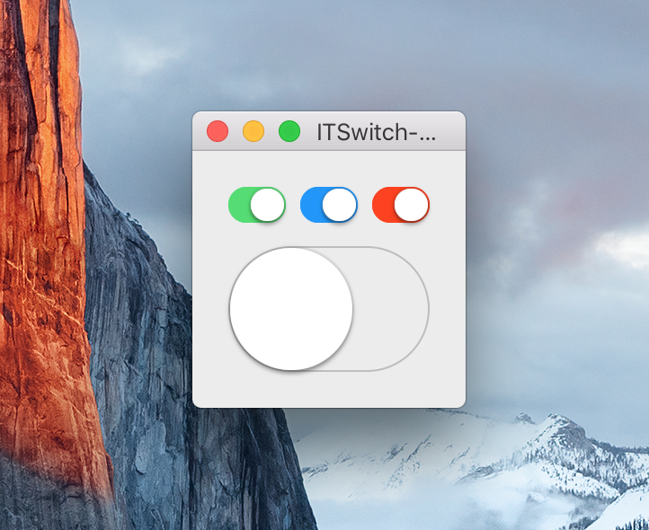

ITSwitch
========

`ITSwitch` is a simple and lightweight replica of iOS 7 `UISwitch` for Mac OS X.



Usage
-----

Not much to it, simply set the custom class of a `NSView` to `ITSwitch` in Interface Builder.

You can create an IBAction and simply connect the two in Interface Builder.

Additionally, you can use these two properties:

```objc
@property (nonatomic, getter = isOn) BOOL on;
@property (nonatomic, strong) NSColor *tintColor;
```

Since `ITSwitch` uses its `CALayer` to draw a drop-shadow, you should also layer-back it's superview.
If you don't use Core Animation, you can also simply embed the view in a layer-backed view.

Requirements
------------

ITSwitch requires 10.7+ and linking against the QuartzCore.framework. 

Tips
----

You may want to consider setting the width of the view to the golden ratio * height. 

So for example:

```objc
height = 20;
width = height * 1.618;
```
